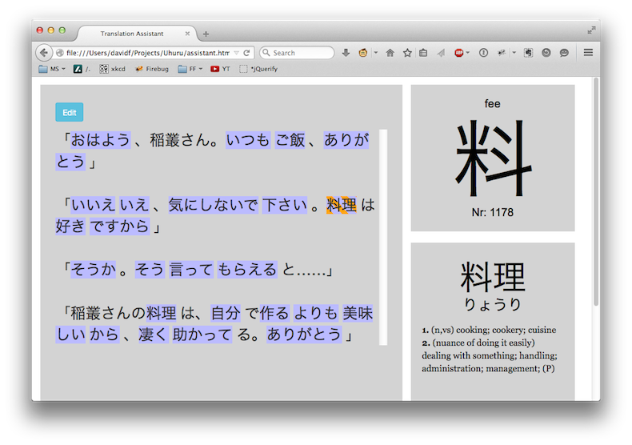

# Uhuru


Uhuru is a translation assistant for reading Japanese text quickly.

Just paste in some Japanese text or dialogue, and hover over some words
to immediately look up their meanings based on the [EDICT] dictionary.
Kanji characters are also looked up based on the [Remembering the Kanji]
keywords.



Uhuru is named after the original Swahili word that inspired the
name of [Uhura] from the original Star Trek series, a famous translator.
Since "uhuru" ends in -ru, it reminds me of a る-verb.

[Uhura]: https://en.wikipedia.org/wiki/Uhura
[EDICT]: http://www.edrdg.org/jmdict/edict.html
[Remembering the Kanji]: https://en.wikipedia.org/wiki/Remembering_the_Kanji_and_Remembering_the_Hanzi

## Prerequisites

* Git
* Python 3.4+

## Installation

(1) Check out Git submodules:

```
git submodule update --init
```

(2) Build the data files by running the following commands in a terminal from this directory:

```
python3 make_edict_db.py
python3 make_edict_utf8.py  # optional
python3 make_rtk_db.py
python3 make_stops.py
```

(3) Open the `assistant.html` file directly in either Safari 7.1.2+ or Firefox 35+. Chrome is known to have issues.

(4) Click the "Edit" button, paste in some Japanese text, and click "Edit" again to save. If you don't have any Japanese text handy, try this short dialogue:

> 「おはよう、稲叢さん。いつもご飯、ありがとう」
> 
> 「いいえいえ、気にしないで下さい。料理は好きですから」
> 
> 「そうか。そう言ってもらえると……」
> 
> 「稲叢さんの料理は、自分で作るよりも美味しいから、凄く助かってる。ありがとう」

(5) Hover over words and characters to look them up. Click a word to highlight it permanently and surround it with spaces, making it easier to see later.

## License

Copyright (c) 2015 David Foster

<a rel="license" href="http://creativecommons.org/licenses/by-nc/4.0/"></a><br />This work is licensed under a <a rel="license" href="http://creativecommons.org/licenses/by-nc/4.0/">Creative Commons Attribution-NonCommercial 4.0 International License</a>.
